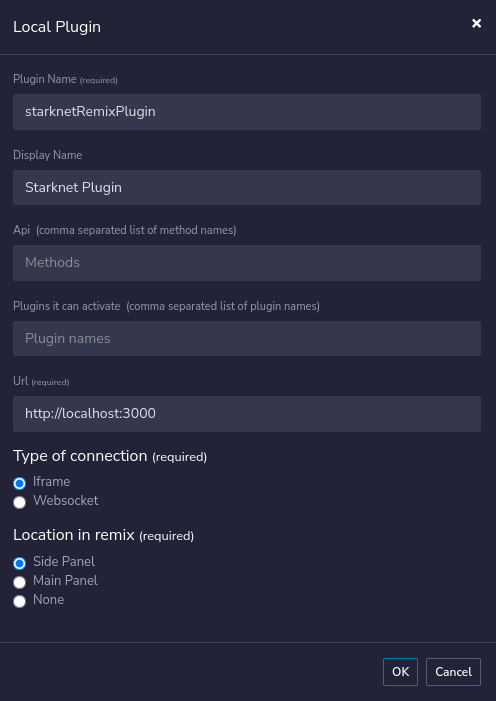

# Starknet Remix Plugin

This is a plugin for Remix IDE that allows you to deploy and interact with StarkNet contracts.

## Installation

### API

The API is a Rust project that uses [Rocket](https://rocket.rs/). Therefore you'll need to install Rust and Cargo, [see](https://www.rust-lang.org/tools/install).
Ideally you'll want to want use [rustup](https://rustup.rs/) to install Rust.

```bash
cd api;
git submodule update --init;
cargo build;
```

For now, the files in the examples are compiled properly with Cairo v1.0.0-alpha.6, so you'll need to checkout that cairo release tag:

```bash
git checkout v1.0.0-alpha.6;
cargo build;
```

Cairo lang also needs to be installed in order to use the `starknet-class-hash` tool, [see](https://docs.starknet.io/documentation/getting_started/environment_setup/).

### Plugin

The plugin it self is a React project, you'll need to install [pnpm](https://pnpm.io/).

```bash
cd plugin;
pnpm install;
```

## Development

You need to be running both the server and the plugin in order to have a working environment.

```bash
cd plugin;
pnpm run dev;
```

```bash
cd api;
cargo run;
```

or alternatively, you can run the server in watch mode (with `cargo watch`):

```bash
cargo install cargo-watch;
cargo watch -x run;
```

For devnet interactions, you'll need to use [Starknet Devnet](https://github.com/Shard-Labs/starknet-devnet).

## Connecting the plugin

In [Remix](http://remix-alpha.ethereum.org/), go to the `Plugin Manager` at the bottom of the left panel, and click on `Connect to a Local Plugin`.

Then, chose a name for the plugin, and in the `URL` field, enter `http://localhost:3000`, the `Type of Connection` should `iframe` and the `Location in remix` `Side Panel` and click on `Ok`, see the image below.



You should be able to activate and see the plugin now.
