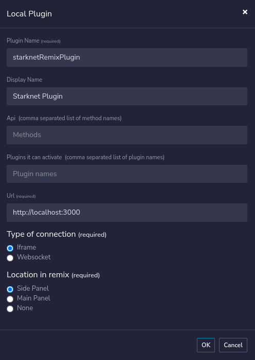

# Starknet Remix Plugin

[](https://github.com/NethermindEth/starknet-remix-plugin/issues)
[](https://discord.com/invite/PaCMRFdvWT)
[](https://t.me/starknetremix)

Welcome to the **Starknet Remix Plugin** repository! 🎉 

This powerful tool seamlessly integrates with the Remix IDE, enabling developers to effortlessly deploy and interact with StarkNet contracts! Whether you're a Cairo and Starknet wizard 🧙‍♂️ or taking your very first steps, this plugin supercharges your journey by providing an effortless way to deploy and interact with StarkNet contracts. Happy coding! 🚀

<details>
<summary>Table of Contents</summary>

- [Starknet Remix Plugin](#starknet-remix-plugin)
  - [For Users](#for-users)
    - [Getting Started](#getting-started)
      - Installation
      - Usage
      - Feedback
  - [For Developers](#for-developers)
    - [Installation](#installation)
      - [API](#api)
      - [Plugin](#plugin)
    - [Running the Development Environment](#running-the-development-environment)
      - [Connecting the Plugin](#connecting-the-plugin)
  - [Support and Contributions](#support-and-contributions)

</details>

## For users

If you're looking to utilize the capabilities of StarkNet contracts within the Remix IDE, you've come to the right place. This section provides you with a straightforward guide to get started.

### Getting Started

1. **Installation**: Get excited, folks, no complicated installations needed here! If you're a user, all you have to do is head over to the Remix IDE and locate the Starknet Remix Plugin in the plugins section. Want to make it even simpler? Click right through to Remix using [this direct link](https://remix.ethereum.org/#activate=Starknet-cairo1-compiler) and you're good to go! 🎉

2. **Usage**: Once the plugin is activated, you'll find a user-friendly interface that allows you to deploy and interact with StarkNet contracts. Follow the on-screen prompts and tooltips for an effortlessly smooth experience!

3. **Feedback**: Your feedback is invaluable to us 🌟! If you encounter any issues or have game-changing suggestions, don't hesitate to reach out through our [Discord](https://discord.com/invite/PaCMRFdvWT) or our [Community Forum](https://community.nethermind.io/). Let's make something awesome together! 🤝

## For Developers

### Installation

#### API

Our API is built with [Rocket](https://rocket.rs/), a web framework for Rust. So, you'll need to get Rust and Cargo on your machine to get started. 🛠️

The easiest way to install Rust and Cargo is by using [rustup](https://rustup.rs/). It's the [recommended tool](https://www.rust-lang.org/tools/install) for managing Rust versions and associated tools for your project.

Then:

```bash
cd api;
git submodule update --init;
cargo build;
```

#### Plugin

The plugin it self is a React project, you'll need to install [pnpm](https://pnpm.io/installation#using-npm).

```bash
cd plugin;
pnpm install;
```

#### Running the development environment

You need to be running both the server and the plugin in order to have a working environment.

For your dev environment:
```bash
cd plugin;
pnpm run start;
```

For an optimized build (will not listen to changes):
```
pnpm run deploy;
pnpm run serve;
```

```bash
cd api;
cargo run;
```

or alternatively, you can run the server in watch mode (with `cargo watch`):

```bash
cargo install cargo-watch;
cargo watch -x run;
```

For devnet interactions, you'll need to use [Starknet Devnet](https://github.com/Shard-Labs/starknet-devnet).

##### Connecting the plugin

In [Remix](http://remix-alpha.ethereum.org/), go to the `Plugin Manager` at the bottom of the left panel, and click on `Connect to a Local Plugin`.

Then, chose a name for the plugin, and in the `URL` field, enter `http://localhost:3000`, the `Type of Connection` should `iframe` and the `Location in remix` `Side Panel` and click on `Ok`, see the image below.



You should be all set to see the magic happen! Activate the plugin and it should now be visible and ready to be hacked with! 🚀

## Support and Contributions

Feel free to contribute! Spotted any [issues](https://github.com/NethermindEth/starknet-remix-plugin/issues)? Head on over to our [good first issues](https://github.com/NethermindEth/starknet-remix-plugin/issues?q=is%3Aissue+is%3Aopen+label%3A%22good+first+issue%22) or read through our [Contribution Guidelines](/docs/CONTRIBUTING.md) to get started. 📝

Jump into our [Discord channel](https://discord.com/invite/PaCMRFdvWT) and join our thriving [community](https://community.nethermind.io/)! Connect with other users, share insights, and get all your questions answered. Our community is always eager to help newcomers! 🤝

We're thrilled for you to experience the Starknet Remix Plugin, and we can't wait to see the inventive ways you'll engage with StarkNet contracts! Happy coding! 💡

