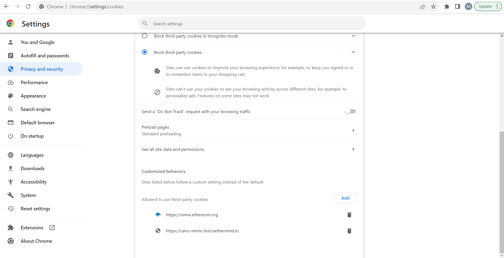

<div align="center">
 <h1> Starknet Remix Plugin </h1>
</div>

<!-- markdownlint-disable -->
<div align="center">
  
</div>

<div align="center">

[](https://remix.ethereum.org/#activate=Starknet)
[](https://github.com/NethermindEth/Starknet-remix-plugin/issues)
[](https://discord.com/invite/PaCMRFdvWT)
[](https://t.me/StarknetRemixPlugin)

</div>

Welcome to the **Starknet Remix Plugin** repository! 🎉 

This powerful tool seamlessly integrates with the Remix IDE, enabling developers to effortlessly deploy and interact with Starknet contracts! Whether you're a Cairo and Starknet wizard 🧙‍♂️ or taking your very first steps, this plugin supercharges your journey by providing an effortless way to deploy and interact with Starknet contracts. Happy coding! 🚀

<details> 
<summary>Table of Contents</summary>

- [Starknet Remix Plugin](#Starknet-remix-plugin)
  - [For Users](#for-users)
    - [Getting Started](#getting-started)
      - Installation
      - Usage
      - Feedback
  - [For Developers](#for-developers)
    - [Installation](#installation)
      - [API](#api)
      - [Plugin](#plugin)
    - [Running the Development Environment](#running-the-development-environment)
      - [Connecting the Plugin](#connecting-the-plugin)
  - [Support and Contributions](#support-and-contributions)

</details>

## For users

If you're looking to utilize the capabilities of Starknet contracts within the Remix IDE, you've come to the right place. This section provides you with a straightforward guide to get started.

### Getting Started

1. **Installation**: Get excited, folks, no complicated installations needed here! If you're a user, all you have to do is head over to the Remix IDE and locate the Starknet Remix Plugin in the plugins section. Want to make it even simpler? Click right through to Remix using [this direct link](https://remix.ethereum.org/#activate=Starknet) and you're good to go! 🎉

2. **Usage**: Once the plugin is activated, you'll find a user-friendly interface that allows you to deploy and interact with Starknet contracts. Follow the on-screen prompts and tooltips for an effortlessly smooth experience!

3. **Feedback**: Your feedback is invaluable to us 🌟! If you encounter any issues or have game-changing suggestions, don't hesitate to reach out through our [Discord](https://discord.com/invite/PaCMRFdvWT) or our [Community Forum](https://community.nethermind.io/). Let's make something awesome together! 🤝

### Troubleshooting

Most issues with Starknet plugin or Remix itself are caused by connectivity problems (also resulting from restricted networks, web-proxies blocking certain content, etc.) or browser plugin interference. 
- A user should first attempt to disable any browser components & addons which may impact the connectivity or Javascript execution. 
- Some networks may restrict connectivity to certain sites or domains. Using a VPN connection may resolve problems observed on restricted networks.

More specific potential error causes are also described in detail below. 

<details>
<summary><strong>1. Problems when searching plugins in Remix UI</strong></summary>  
<br/>
Searching for online plugins in Remix IDE may return blank or otherwise incorrect content, such as on screenshot below:


Ensure that the following URL is accessible from a web browser, and that a JSON metadata code is returned -  
https://raw.githubusercontent.com/ethereum/remix-plugins-directory/master/build/metadata.json :


</details>

<details>
<summary><strong>2. Problems when launching Starknet plugin in Remix UI</strong></summary> 
<br/>  
Starknet plugin launch issues may be caused by connectivity errors or plugin components being unavailable. This can be tested from web browser, as indicated below:

- https://cairo-remix.nethermind.io should respond with blank page (advanced: viewing page source will reveal a React component entry HTML markup) - no errors should be reported by the browser
- https://cairo-remix-api.nethermind.io/health should respond with `OK`
- https://starknet-remix-devnet.nethermind.io/predeployed_accounts should respond with JSON text describing predeployed Starknet accounts
</details>

<details>
<summary><strong>3. `localStorage` access errors</strong></summary>  
<br/>
The following error indicates that the browser is blocking access to `localStorage` element of the webpage:


Possible causes:
  
   - Chrome is launched in incognito mode
   - Chrome setting "Block third-party cookies" is activated (see [chrome://settings/cookies](chrome://settings/cookies)):

Note: even with "Block third-party cookies" activate, exceptions can be added to a whitelist - the whitelist must include:
     - https://remix.ethereum.org
     - https://cairo-remix-test.nethermind.io
   - ...also see this [link](https://stackoverflow.com/questions/30481516/iframe-in-chrome-error-failed-to-read-localstorage-from-window-access-deni) for potential hints.
</details>

## For Developers

### Installation

#### API

Our API is built with [Rocket](https://rocket.rs/), a web framework for Rust. So, you'll need to get Rust and Cargo on your machine to get started. 🛠️

The easiest way to install Rust and Cargo is by using [rustup](https://rustup.rs/). It's the [recommended tool](https://www.rust-lang.org/tools/install) for managing Rust versions and associated tools for your project.

Then:

```bash
cd api;
git submodule update --init;
cargo build;
```

#### Plugin

The plugin it self is a React project, you'll need to install [pnpm](https://pnpm.io/installation#using-npm).

```bash
cd plugin;
pnpm install;
```

#### Running the development environment

You need to be running both the server and the plugin in order to have a working environment.

For your dev environment:

```bash
cd plugin;
export API_SERVICE_URL=http://localhost:8000
export STARKNET_DEVNET_URL=http://localhost:5050
pnpm run start;
```

For an optimized build (will not listen to changes):
```bash
export API_SERVICE_URL=http://localhost:8000
export STARKNET_DEVNET_URL=http://localhost:5050
pnpm run deploy;
pnpm run serve;
```

```bash
cd api;
export VITE_URL=http://localhost:3000
cargo run;
```

or alternatively, you can run the server in watch mode (with `cargo watch`):

```bash
export VITE_URL=http://localhost:3000
cargo install cargo-watch;
cargo watch -x run;
```

For devnet interactions, you'll need to use [Starknet Devnet](https://github.com/Shard-Labs/Starknet-devnet).

##### Connecting the plugin

In [Remix](http://remix-alpha.ethereum.org/), go to the `Plugin Manager` at the bottom of the left panel, and click on `Connect to a Local Plugin`.

Then, chose a name for the plugin, and in the `URL` field, enter `http://localhost:3000`, the `Type of Connection` should `iframe` and the `Location in remix` `Side Panel` and click on `Ok`, see the image below.


You should be all set to see the magic happen! Activate the plugin and it should now be visible and ready to be hacked with! 🚀

## Support and Contributions

Feel free to contribute! Spotted any [issues](https://github.com/NethermindEth/Starknet-remix-plugin/issues)? Head on over to our [good first issues](https://github.com/NethermindEth/Starknet-remix-plugin/issues?q=is%3Aissue+is%3Aopen+label%3A%22good+first+issue%22) or read through our [Contribution Guidelines](/docs/CONTRIBUTING.md) to get started. 📝

Jump into our [Discord channel](https://discord.com/invite/PaCMRFdvWT) and join our thriving [community](https://community.nethermind.io/)! Connect with other users, share insights, and get all your questions answered. Our community is always eager to help newcomers! 🤝

We're thrilled for you to experience the Starknet Remix Plugin, and we can't wait to see the inventive ways you'll engage with Starknet contracts! Happy coding! 💡

