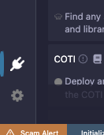
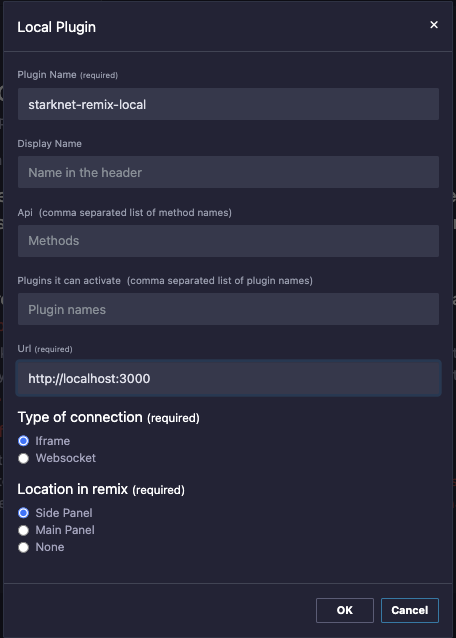
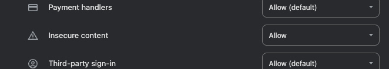

# Setting Up Development Environment

To set up your development environment for the Starknet Remix Plugin, follow these steps:

1. Clone the repository:```bash
git clone https://github.com/NethermindEth/starknet-remix-plugin
```

2. Install dependencies:

```bash
cd starknet-remix-plugin/plugin
pnpm install
```

3. Start the development server:

For UI:

```bash
cd starknet-remix-plugin/plugin
API_SERVICE_URL="http://localhost:8000" pnpm start
```

For API:

```bash
cd starknet-remix-plugin/api
VITE_URL=http://localhost:3000 SERVICE_VERSION="v0.0.1" cargo run
```

4. Connect local plugin to the Remix IDE:

- Go to the Remix IDE at <https://remix.ethereum.org/>
- Go to the Plugin Manager

<div align="center">
  
  <p><em>Plugin manager icon</em></p>
</div>

- Click "Connect to Local Plugin"
- Fill in the required fields

<div align="center">
  
  <p><em>Add local plugin interface</em></p>
</div>

5. You are now connected to the Starknet Remix Plugin and can start developing your Starknet applications.

## Common Issues

### Plugin connected but it can't send requests to the API

To resolve this issue, ensure that you set all environment variables correctly and that the API server is running.

If this didn't resolve the issue and you are using chrome browser, try to enable "insecure content" in the browser settings.

<div align="center">
  
  <p><em>Insecure content</em></p>
</div>