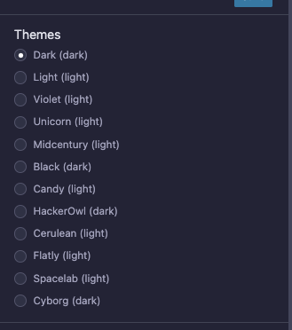
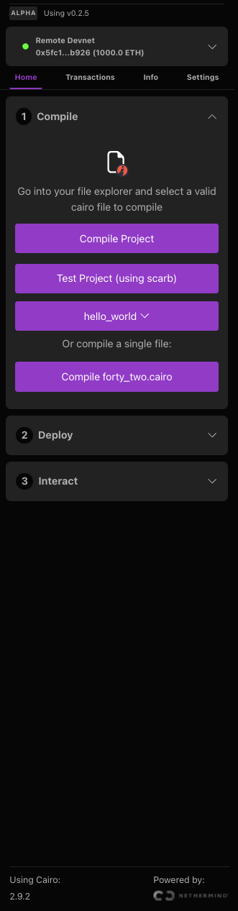
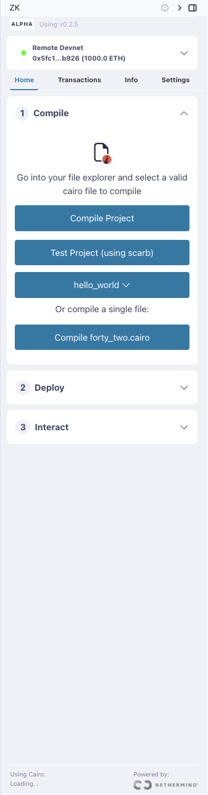
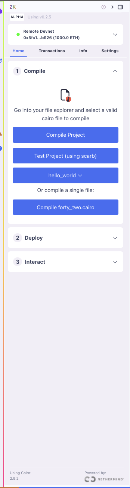

# Themes

The Starknet Remix Plugin seamlessly integrates with Remix IDE's theming system, allowing you to customize your development environment's appearance for better readability and reduced eye strain.

## Theme Integration

The plugin automatically inherits and applies the theme you've selected in Remix IDE. This ensures a consistent visual experience across your entire development environment.

  
  
<em>Theme selection in Remix IDE</em>

## Available Themes

Remix IDE offers several built-in themes that the plugin supports:

1. **Light Theme**
   - High contrast for daylight conditions
   - Clear code visibility
   - Professional appearance

2. **Dark Theme**
   - Reduced eye strain in low-light conditions
   - Optimal for long coding sessions
   - Modern developer experience

3. **Dark+**
   - Enhanced dark mode
   - Additional syntax highlighting
   - Improved contrast ratios

## Changing Themes

To change the plugin's appearance:

1. Access Remix Settings:
   - Click the Settings icon in Remix IDE
   - Navigate to the "Theme" section

2. Select Your Preferred Theme:
   - Choose from available theme options
   - Preview the appearance
   - Apply the selected theme

3. Plugin Update:
   - The plugin automatically adopts the new theme
   - No additional configuration required
   - Refresh the page if changes don't apply immediately

  

    
    
    
  

  

    <em>From left to right: Cyborg theme, Light theme, and Unicorn theme</em>
  

## Future Enhancements

We're working on additional theme-related features:
- Custom theme support
- Syntax highlighting customization
- Contract-specific color schemes

## Next Steps

After setting up your preferred theme:
- Explore [other features](./additional-features.md)
- Configure your [development environment](../basic-usage/settings.md)
- Start [developing contracts](../basic-usage/compilation.md)

Remember that the right theme can significantly improve your productivity and reduce eye strain during long development sessions.