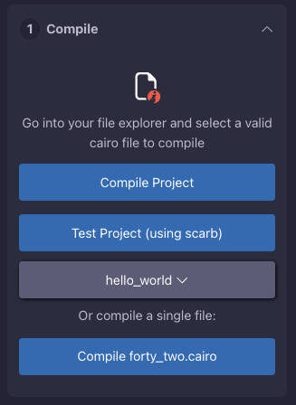

# Compilation

<div align="center">
  
  <p><em>Compilation interface</em></p>
</div>
When you open the compilation accordion, you will see several possible actions you can perform:

## Select project

The plugin analyzes your opened workspace for any `Scarb.toml` files. If such files are found - all files in their directories and all child directories are considered as one Scarb project. When you switch workspaces, the plugin switches its scope. You can see it as a grey button under the `Test Project` button.

## Compile Project

Compiles your selected Scarb project. Several notes to consider:
1. Your project files are sent to the Nethermind compilation servers, where they are compiled.
2. The Scarb version is practically always up-to-date with the latest release, but sometimes there could be some delays (up to 1 day), since the automatic workflow requires manual approval from admins.

## Test Project

Allows you to test the project using either Scarb or Foundry (which can be set in the `Settings` section). Similar to compilation, files are sent to an external compilation server, where they are tested. The testing outcome will show up in the Remix console.

## Single-file Compilation

Single-file Compilation was created for quick interaction with contracts and simplifying the workflow. The contract you've opened in the IDE is sent to the compilation server, where it is transformed into a one-contract Scarb project. The Scarb.toml file is generated as follows:

```toml
[package]
name = "___testsingle"
version = "0.1.0"

[dependencies]
starknet = "{...}"

[[target.starknet-contract]]
sierra = true
casm = true
```

## Best Practices

1. **Regular Compilation**
   - Compile frequently while coding
   - Fix errors as they appear
   - Keep your dependencies up to date

2. **Project Organization**
   - Use meaningful file names
   - Organize contracts in logical folders
   - Keep related functionality together

3. **Error Handling**
   - Read error messages carefully
   - Check line numbers in error messages
   - Verify your code matches the latest Cairo syntax

## Troubleshooting

If you encounter compilation issues:
1. Verify your Cairo syntax
2. Check your Scarb.toml configuration
3. Ensure all dependencies are correctly specified
4. Clear the compilation cache if needed
5. Update to the latest plugin version

## Next Steps

After successful compilation:
- Move on to [contract deployment](./deployment.md)
- Learn about [contract interaction](./interaction.md)
- Configure [compilation settings](./settings.md)