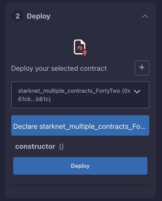
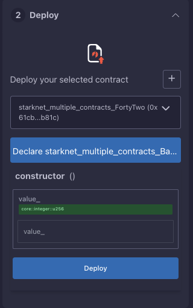
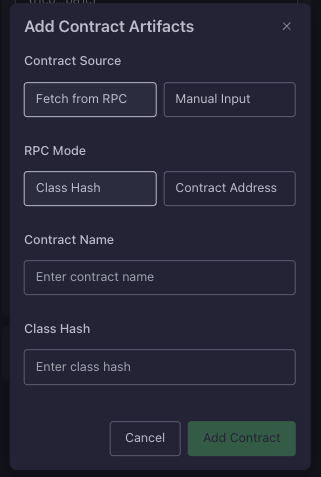
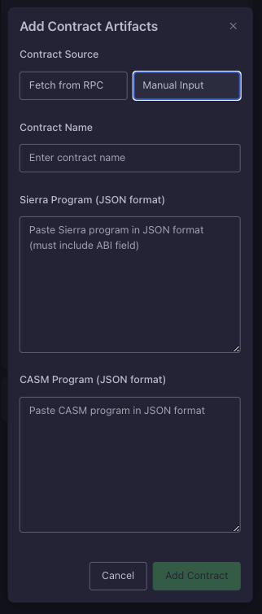

# Deployment

After contract is successfully compiled, you will be able to declare and deploy the contracts. This section also allows to deploy already declared contract by their address / class hash or to manually paste sierra / casm.

  
  
<em>Contract deployment interface</em>

## Declaring

Before deploying a contract on Starknet, you first need to declare it. Declaration registers your contract's code on the network, making it available for deployment. This is a one-time operation per contract - once you've declared a contract, you don't need to declare it again, even if you want to deploy multiple instances of the same contract. To declare your contract, simply click the "Declare" button. You'll see status updates in both the console and on the button itself as the declaration progresses.

## Deploying

After declaring the contract you can deploy it using `Deploy` button. Note that sometimes you have the constructor arguments here, which you need to set before submitting the deployment. After triggering the process you will see status update in the IDE console and as a circle rotation near "Deploy" header.

  
  
<em>Constructor arguments interface for contract deployment</em>

## Importing contracts: deploying declared class hashes / manual approach

If you have a contract that has already been declared on the network, you can deploy it directly using its class hash. You can do it by clicking `+` button, after that you'll see the following dialog window:

  
  
<em>Import contract</em>

From there you can see various input fields and options. First, you need to set the Contract source: You can either paste the contract's Sierra and CASM code directly (Manual Input), or provide the class hash or contract address of an already declared contract (RPC). RPC is dependent on the current select environment, e.g. in order to change the network you should go to your wallet / environment selection. This allows you to work with contracts that were declared outside of the plugin.

When using RPC Mode, you have two options:
- Class Hash Mode: Directly input a specific class hash to deploy a contract from that class
- Contract Class Mode: Provide a contract address, and the plugin will automatically fetch and use its associated class hash

For RPC deployment, you'll need to fill in:
- Contract Name: A descriptive name that will be used to identify your contract throughout the plugin
- Class Hash/Contract Address: Depending on your selected mode, enter either the class hash or contract address

  
  
<em>Manual input interface for contract deployment</em>

For manual deployment, you'll need to provide:
- Contract Name: A descriptive name for your contract
- Sierra Program: The contract's Sierra code in JSON format
- CASM Program: The contract's CASM code in JSON format

## After Deployment

Once your contract is successfully deployed:
1. Save your contract address for future reference
2. Verify your contract on [Starkscan](https://starkscan.co) or [Voyager](https://voyager.online)
3. Test basic interactions to ensure everything works as expected

## Next Steps

After deploying your contract, you can:
- Learn how to [interact with your contract](./interaction.md)
- Manage your contract's [transactions](../transactions.md)
- Explore [advanced features](../advanced-features.md)
- Configure contract [settings](./settings.md)

Remember to always test thoroughly on testnet before deploying to mainnet. Keep your deployment information secure and maintain proper documentation for your project. Don't deploy contracts that you're not familiar with.

