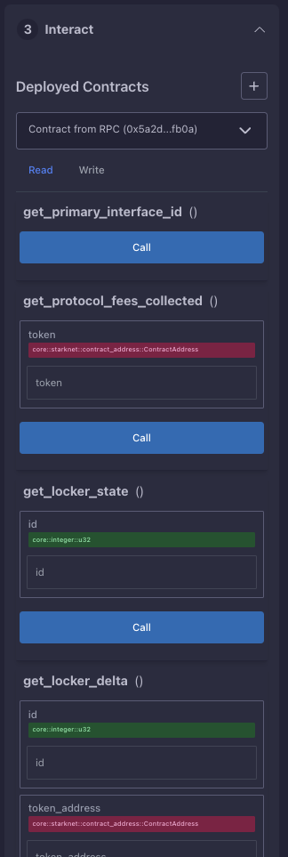
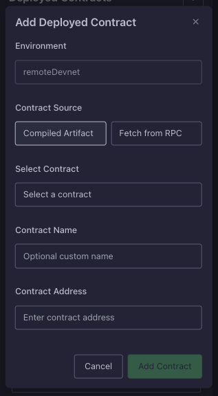
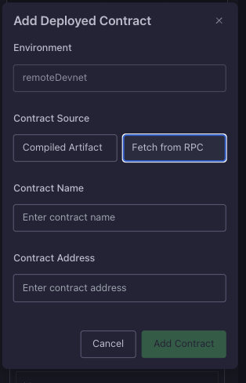

# Contract Interaction

Once a contract is deployed, you'll be redirected to the `Interact` tab:

  
  
<em>Contract interaction interface</em>

From here you can easily trigger contract functions.

## Interacting with contract

1. To interact with the contract, you need to select the contract you want to interact with using the select component.

2. After selecting the desired contract, you can call a function. Functions are split by their type - either read or write.

3. Type the input fields and click `Call`. After that you will be able to see the outcome in the IDE console.

## Importing existing contracts

The same as in the `Deploy` section, here you can import already deployed contract (not only from the plugin). 

  
  
<em>Import contract interface</em>

There are also two options of how you import contract:
1. Compiled artifact - load existing compiled artifact (that is stored in the plugin's memory) and link it the existing contract by contract address, input fields:
    - "Select contract" - allows you to select contract among compiled / imported
    - Contract name (optional) - set the custom contract name, if not set will use placeholder instead.
    - Contract address
    - Contract class hash (disabled field, read-only) - hash of the contract class that will be fetched from the contract artifacts
2. Fetch from RPC - fetch contract data directly from the network, input fields:
    - Contract name (optional) - set the custom contract name, if not set will use placeholder instead.
    - Contract address

  
  
<em>Import contract from RPC interface</em>

After importing the contract, you can interact with it just like with any other contract deployed through the plugin.

> !!! Be careful when importing contracts from RPC - you need to make sure that the contract class hash matches the one you expect. Otherwise, you might be interacting with a malicious contract. Ineract with contract only when you know what you are doing!

## Additional Resources

**Block Explorers**
    - [Starkscan](https://starkscan.co) - View detailed transaction history and contract state
    - [Voyager](https://voyager.online) - Alternative explorer with additional features

## What's Next?

- [Transactions](./transactions.md)
- [Settings](./settings.md)
- [Environment](./environment.md)