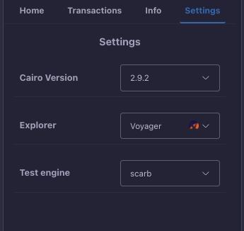

# Settings

The Starknet Remix Plugin offers several configuration options to customize your development experience. This section covers the available settings and how to use them effectively.

  
  
<em>Settings interface</em>

## Cairo Version

The Cairo version setting allows you to select which version of the Cairo programming language to use for compilation.

### Version Selection
- Choose from available Cairo versions
- Automatically loads compatible versions
- Shows currently selected version
- Updates compiler settings accordingly

> Note: The plugin supports the three most recent minor versions with their latest patches. For example, if the latest version is 2.4.0, then 2.4.0, 2.3.1, and 2.2.3 would be supported.

## Block Explorer

Configure your preferred block explorer for viewing contract and transaction details.

### Available Options
- **Starkscan**: Comprehensive transaction and contract explorer
- **Voyager**: Official Starknet block explorer
- **ViewBlock**: Alternative explorer with additional analytics

Your selected explorer will be used throughout the plugin for:
- Viewing transaction details
- Checking contract states
- Verifying deployments
- Monitoring events

## Test Engine

Choose your preferred testing framework for running contract tests.

### Testing Options
1. **Scarb**
   - Default testing framework
   - Integrated with Scarb package manager
   - Native Cairo test support

2. **Forge**
   - Alternative testing framework
   - Additional testing features
   - Compatible with Cairo contracts

## Best Practices

1. **Version Management**
   - Keep Cairo version up to date
   - Check compatibility with existing contracts
   - Test thoroughly when changing versions

2. **Explorer Selection**
   - Choose based on your specific needs
   - Consider features like API access
   - Verify explorer reliability

3. **Testing Configuration**
   - Select appropriate test engine for your project
   - Maintain consistent testing environment
   - Document testing setup

## Troubleshooting

If you encounter issues with settings:
1. Verify Cairo version compatibility
2. Check network connectivity for explorer access
3. Ensure test engine prerequisites are met
4. Try refreshing the plugin if settings don't load

## Next Steps

After configuring your settings:
- Start [compiling contracts](./compilation.md)
- Set up your [testing environment](../advanced-features.md)
- Begin [contract deployment](./deployment.md)

Remember to review your settings periodically, especially when starting new projects or updating existing ones. Proper configuration ensures a smooth development experience.