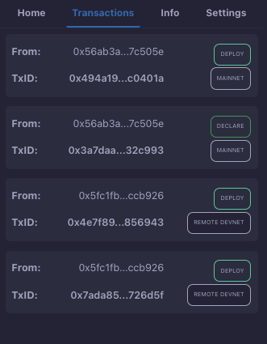

# Transactions

The Starknet Remix Plugin provides a comprehensive transaction management system that helps you track and monitor all your contract interactions. This section explains how to understand and manage your transactions effectively.

  
  
<em>Transactions interface</em>

## Transaction Types

The plugin supports several types of transactions:

1. **Deploy**
   - Contract deployment transactions
   - Shows deployment address and status
   - Links to deployed contract

2. **Declare**
   - Contract declaration transactions
   - Required before deployment
   - Registers contract class on network

3. **Invoke**
   - Function call transactions
   - Contract interaction records
   - State-changing operations

## Transaction Information

Each transaction card displays essential information:

### 1. Transaction Details
- **From**: Sender's address (shortened for readability)
- **TxID**: Unique transaction identifier
- **Network**: Current network (e.g., Goerli, Mainnet)

### 2. Status Indicators
- Transaction type tag
- Network environment tag
- Execution status

## Transaction Exploration

### Block Explorer Integration
- Click on transaction IDs to view details in your configured block explorer
- View detailed transaction information
- Track transaction status
- Access contract interactions

### Address Links
- Click on addresses to view them in the block explorer
- View account details and history
- Track contract interactions
- Monitor account activity

## Troubleshooting

If you encounter transaction issues:

1. **Pending Transactions**
   - Check network status
   - Verify wallet connection
   - Confirm sufficient balance
   - Wait for network confirmation

2. **Failed Transactions**
   - Check error messages
   - Verify input parameters
   - Confirm gas settings
   - Review contract state

## Next Steps

After understanding transaction management:
- Learn about [contract interaction](./interaction.md)
- Configure [block explorer settings](./settings.md)
- Explore [advanced features](../advanced-features.md)

Remember to always verify transaction details before signing and keep records of important transactions for future reference. For production deployments, maintain a comprehensive log of all significant transactions.
