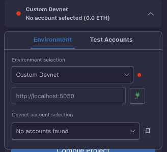

# Custom Devnet

The Starknet Remix Plugin allows you to connect to your own custom devnet instance while maintaining the same seamless development experience provided by the default remote devnet.

  
  
<em>Custom devnet configuration interface</em>

## Configuration

Setting up a custom devnet connection is straightforward. In the environment dropdown, select "Custom Devnet" and you'll be presented with a configuration interface. Enter your devnet URL in the provided input field and click the connect button to establish the connection.

The plugin will automatically verify the connection and provide immediate feedback about the devnet's availability. Once connected, you'll have access to all the standard devnet features through your custom instance.

## Connection Management

The plugin maintains a persistent connection to your custom devnet and provides real-time status updates. You can:

- Monitor connection status through the indicator icon
- Disconnect and reconnect as needed
- Switch between different devnet instances
- View network details and status

## Account Handling

When connecting to a custom devnet, the plugin automatically fetches and displays available predeployed accounts. These accounts function identically to those on the remote devnet, providing:

- Full transaction capabilities
- Balance management
- Contract deployment access
- State modification abilities

## Network Integration

Your custom devnet integrates seamlessly with all plugin features:

### Development Tools
The plugin provides the same development experience as with the remote devnet, including:
- Contract compilation
- Deployment management
- Transaction handling
- State inspection

### Testing Environment
Custom devnet offers full testing capabilities with:
- Consistent state management
- Predictable execution
- Custom network conditions
- Flexible configuration options

## Troubleshooting

If you encounter issues with your custom devnet:

1. Verify the devnet URL is correct and accessible
2. Check if the devnet instance is running and responding
3. Ensure network connectivity between your browser and the devnet
4. Monitor the browser console for detailed error messages

## Next Steps

After configuring your custom devnet:
- Start [deploying contracts](../basic-usage/deployment.md)
- Set up [local node](https://docs.starknet.io/tools/devtools/devnets/)
- Configure [account management](./manual-account.md)

Remember to maintain proper network security and regularly verify your devnet's status when using a custom configuration.
