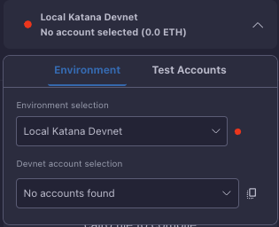

# Katana Integration

Katana is a blazingly fast Starknet sequencer that provides a powerful local development environment. The Starknet Remix Plugin offers seamless integration with Katana, allowing you to leverage its advanced features for rapid development and testing.

<div align="center">
  
  <p><em>Katana integration interface</em></p>
</div>

## Overview

Katana serves as both a development environment and a production-ready sequencer. In development mode, it provides specialized RPCs for manipulating the execution context, while in production, it functions as a high-performance sequencer optimized for gaming workloads and cross-layer communication.

## Installation

You can install Katana directly from source using cargo:

```bash
git clone https://github.com/dojoengine/dojo
cd dojo
cargo install --path ./bin/katana --locked --force
```

## Configuration in Remix

Setting up Katana in the Starknet Remix Plugin is straightforward:

1. Select "Local Katana Devnet" from the environment dropdown
2. The plugin will automatically detect your local Katana instance
3. Connect to the network using the connection button

## Predeployed Contracts

Katana comes with several predeployed contracts ready for use:

### Fee Token Contract
- Address: 0x49d36570d4e46f48e99674bd3fcc84644ddd6b96f7c741b1562b82f9e004dc7
- Handles transaction fee management
- Provides token functionality

### Universal Deployer
- Address: 0x41a78e741e5af2fec34b695679bc6891742439f7afb8484ecd7766661ad02bf
- Facilitates contract deployment
- Manages deployment operations

### Account Contract
- Address: 0x05400e90f7e0ae78bd02c77cd75527280470e2fe19c54970dd79dc37a9d3645c
- Provides account abstraction
- Manages transaction signing and execution

## Account Management

Katana provides several prefunded accounts for development. Each account comes with:

- A unique address and private key
- Prefunded balance for testing
- Full transaction capabilities
- Deployment permissions

The plugin automatically detects and displays these accounts in the interface, allowing you to easily switch between them for testing different scenarios.

## Development Features

Katana provides several advanced features for development:

### JSON-RPC Support
The sequencer implements Starknet JSON-RPC v0.7.1, ensuring compatibility with standard tools and libraries. You can interact with your contracts using familiar methods and interfaces.

### Cross-Layer Communication
Katana supports communication between different layers:
- L1 <> L2 interactions
- Layer N to Layer N+1 messaging
- State synchronization

### State Management
Development-specific features include:
- State forking capabilities
- Blockchain state manipulation
- Custom execution contexts
- Flexible configuration options

## Troubleshooting

If you encounter issues:

1. Verify Katana is running locally (default port: 5050)
2. Check for console errors in both Katana and browser
3. Ensure your system meets the minimum requirements
4. Restart Katana if you encounter state inconsistencies

## Next Steps

After setting up Katana:
- Explore [contract deployment](../basic-usage/deployment.md)
- Learn about [transaction management](../basic-usage/transactions.md)
- Configure [custom networks](./custom-devnet.md)

Remember that Katana provides a powerful development environment, but always test your contracts on testnet before deploying to mainnet.
