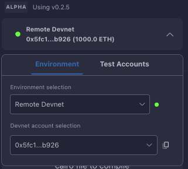

# Development Networks (Devnet)

The Starknet Remix Plugin provides access to development networks (devnets) for testing and development purposes. The plugin offers a seamless experience with a hosted devnet solution maintained by Nethermind, eliminating the need for local setup and configuration.

  
  
<em>Devnet selection interface</em>

## Remote Devnet

The remote devnet is a hosted development environment provided and maintained by Nethermind. This service is automatically available to all plugin users and offers several advantages:

- No local setup required
- Automatic daily updates
- High availability and reliability
- Consistent testing environment

The remote devnet runs on Nethermind's infrastructure and is automatically configured when you select it in the environment dropdown. This ensures you can start developing immediately without any additional setup steps.

## Working with Remote Devnet

When using the remote devnet, you'll have access to:

### Predeployed Accounts
The devnet comes with several pre-funded accounts ready for use. Each account includes:
- A private key for transaction signing
- Pre-allocated test tokens
- Deployed account contracts
- Ready-to-use configuration

### Network Features
The remote devnet provides a full-featured Starknet environment:
- Block creation and mining
- Transaction processing
- Contract deployment
- State management

## Local Development

While the remote devnet is convenient, you can also run a local devnet for specific needs:

1. **Local Devnet**
   For developers who need complete control over their testing environment.

2. **Custom Configuration**
   When you need specific network parameters or testing conditions.

For these cases, refer to our guides on:
- [Custom Devnet Setup](./custom-devnet.md)
- [Katana Integration](./custom-katana.md)

## Best Practices

When working with devnet environments:

1. **Environment Selection**
   Choose remote devnet for:
   - Quick prototyping
   - Team collaboration
   - Consistent testing environment
   
   Use local devnet for:
   - Custom network configurations
   - Offline development
   - Specialized testing requirements

2. **Account Management**
   - Keep track of predeployed account addresses
   - Monitor account balances
   - Use different accounts for different testing scenarios

## Network Status

The plugin provides real-time status indicators for the devnet connection. You can monitor:
- Network availability
- Connection status
- Account balances
- Transaction processing

## Next Steps

After setting up your devnet environment:
- Learn about [custom devnet configuration](./custom-devnet.md)
- Explore [manual account management](./manual-account.md)
- Start [deploying contracts](../basic-usage/deployment.md)

Remember that while devnet provides a safe environment for testing, you should always verify your contracts thoroughly before deploying to mainnet.
