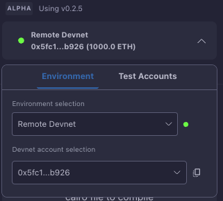

# Environment

The Starknet Remix Plugin offers flexible environment options to suit different development needs. From local development to production deployment, you can choose the environment that best fits your current workflow.

  
  
<em>Environment selection interface</em>

## Available Environments

### 1. [Wallet Connection](./wallet-connection.md)
The wallet connection environment allows you to connect with popular Starknet wallets like Argent X and Braavos for direct interaction with mainnet and testnet networks.

### 2. [Development Networks](./devnet.md)
Development networks include local devnet for fast testing and development, remote devnet providing a hosted environment with no local setup required, and custom devnet allowing you to configure your own instance with flexible network settings.

### 3. [Katana Integration](./custom-katana.md)
Katana provides a local development network with custom configuration options and advanced testing capabilities.

### 4. [Manual Accounts](./manual-account.md)
Manual accounts allow you to create and manage test accounts, deploy account contracts, and maintain flexible account management for testing purposes.

## Environment Features

The environment system includes comprehensive account management with support for multiple accounts, balance monitoring, and transaction history. You can easily switch between different networks while monitoring their status and configuring custom network settings.

The development tools include built-in faucet integration, network monitoring capabilities, account deployment features, and balance management functionality.

## Best Practices

For an effective development workflow, start testing on devnet before moving to testnet and finally to mainnet. Keep track of your deployed accounts and regularly monitor network status.

When managing accounts, ensure secure private key handling, maintain regular balance checks, and always verify you're on the correct network before executing transactions.

## Next Steps

Choose your environment based on your needs:

- [Connect a wallet](./wallet-connection.md) for mainnet/testnet access
- [Set up a local devnet](./devnet.md) for development
- [Configure a custom devnet](./custom-devnet.md) for specific requirements
- [Use Katana](./custom-katana.md) for advanced testing
- [Manage manual accounts](./manual-account.md) for testing purposes

> **Important**: Always verify your selected environment before performing any transactions or deployments.
