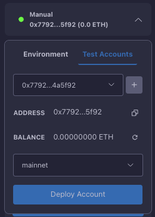

# Manual Accounts

The Starknet Remix Plugin provides powerful manual account management capabilities for testing and development purposes. This feature allows you to create, manage, and deploy test accounts without relying on external wallets or networks.

  
  
<em>Manual account management interface</em>

## Account Creation

Creating a test account is straightforward through the plugin interface. When you create a new account, the plugin automatically generates:

- A unique private key for transaction signing
- The corresponding public key
- A deterministic account address
- Initial balance tracking

The account is created using the OpenZeppelin account contract implementation, ensuring compatibility with standard Starknet account abstraction patterns.

## Network Management

Manual accounts can be used across different Starknet networks. The plugin supports:

### Available Networks
- Mainnet for production deployments
- Goerli and Sepolia for testing
- Custom networks for specialized development

Each account maintains a separate deployment status and balance for each network, allowing you to track your testing environment effectively.

## Account Deployment

Before using a manual account on any network, you need to deploy it. The deployment process involves:

1. Selecting the target network
2. Ensuring sufficient funds for deployment
3. Deploying the account contract
4. Verifying the deployment status

The plugin tracks deployment status per network, preventing unnecessary redeployments and providing clear visibility of account availability across different environments.

## Balance Management

The plugin provides comprehensive balance tracking for each account. You can:

1. View current balance in real-time
2. Refresh balance information manually
3. Request test tokens through integrated faucets
4. Monitor balance changes across transactions

For test networks like Goerli and Sepolia, the plugin includes direct links to respective faucets, streamlining the process of obtaining test tokens.

## Account Storage

Manual accounts are securely stored in your browser's local storage. The plugin maintains:

- Private key encryption
- Account metadata
- Network-specific information
- Deployment status tracking

This information persists across browser sessions but remains isolated to your local environment for security.

## Best Practices

When working with manual accounts, consider these important practices:

### Security Considerations
Never use manual accounts for production environments or real value transactions. These accounts are designed specifically for testing and development purposes.

### Testing Workflow
Create separate accounts for different testing scenarios to maintain clear separation of concerns and avoid state conflicts during development.

### Account Organization
Maintain clear documentation of your test accounts, including their intended purposes and any specific configurations or states they represent.

## Troubleshooting

Common issues you might encounter:

1. **Deployment Failures**
   Check your account balance and network status. Ensure you have sufficient funds for the deployment transaction.

2. **Balance Issues**
   Verify network connectivity and use the refresh button to update balance information. For test networks, ensure you've requested tokens from the appropriate faucet.

3. **Network Connectivity**
   Confirm your selected network is operational and accessible. Try switching networks if you encounter persistent connection issues.

## Next Steps

After setting up your manual accounts:
- Begin [deploying contracts](../basic-usage/deployment.md)
- Learn about [transaction management](../basic-usage/transactions.md)
- Explore [contract interaction](../basic-usage/interaction.md)

Remember that manual accounts are powerful tools for development but should never be used for production deployments or real value transactions. Always use proper wallet accounts for production environments.
