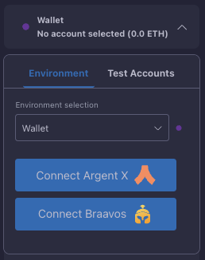

# Wallet Connection

The Starknet Remix Plugin provides seamless integration with popular Starknet wallets, enabling secure interaction with mainnet and testnet networks. This connection method is recommended for production deployments and real-value transactions.

  
  
<em>Wallet connection interface</em>

## Supported Wallets

The plugin currently supports two major Starknet wallets:

### [Argent X](https://www.argent.xyz/argent-x/)
Argent X is a user-friendly wallet that provides a comprehensive suite of features for Starknet interaction. It offers robust security features and an intuitive interface for managing your accounts and transactions.

### [Braavos](https://braavos.app)
Braavos wallet offers an alternative implementation with its own unique features and security model. It provides strong transaction security and account management capabilities.

## Connection Process

Connecting your wallet to the plugin involves a straightforward process:

1. Click the "Connect Wallet" button in the plugin interface
2. Select your preferred wallet from the available options
3. Approve the connection request in your wallet
4. Confirm account access permissions

The plugin will maintain the connection across your development session, allowing seamless interaction with your contracts and the network.

## Network Selection

When using a connected wallet, you have access to multiple networks:

- Mainnet - The production network where real-value transactions occur. Always exercise caution and verify all transaction details when operating on mainnet.

-  Testnet (Goerli/Sepolia)
Test networks for development and validation. These networks use test tokens and provide a safe environment for contract testing before mainnet deployment.

## Troubleshooting

If you encounter connection issues:

1. **Connection Failures**
   Ensure your wallet extension is properly installed and unlocked. Try disconnecting and reconnecting if issues persist.

2. **Transaction Errors**
   Verify you have sufficient balance and are on the correct network. Check that your wallet is properly synced.

3. **Network Switching**
   If changing networks, make sure both the plugin and your wallet are set to the same network to avoid transaction failures.

## Next Steps

After connecting your wallet:
- Start [deploying contracts](../basic-usage/deployment.md)
- Learn about [transaction management](../basic-usage/transactions.md)
- Explore [contract interaction](../basic-usage/interaction.md)

Remember that wallet connections are the recommended method for production deployments and real-value transactions. Always verify your wallet's security settings and keep your software updated.
